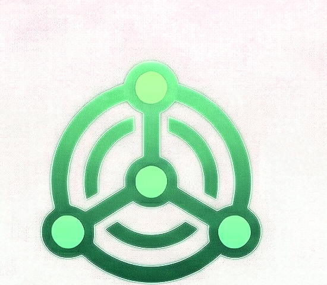

# Concord — Brand

**Tagline:** Mesh Comms System

The image at `branding/logo.png` is the **definitive logo** for concord. It was
cropped from the authoritative icon sheet at
`~/projects/personal_icon_pack.png`. Do not substitute, recolor, or redraw.

## Glyph

Three nodes joined by a triangle of arcs — a peer mesh rendered as a face:
two upper ears, one lower mouth, eye at the center. The symmetry says
"everyone hears everyone" without being hierarchical.

## Color palette

| Role       | Hex        | Name            | Use                                     |
|------------|------------|-----------------|-----------------------------------------|
| Primary    | `#08C838`  | Mesh Emerald    | Brand green, online state, send button  |
| Highlight  | `#08B838`  | Mesh Leaf       | Hover, focus, typing indicator          |
| Accent     | `#088838`  | Mesh Pine       | Secondary buttons, badges               |
| Deep       | `#087838`  | Mesh Root       | Outlines, borders, muted text           |
| Shadow     | `#085828`  | Mesh Soil       | Dark-mode background, deep shadow       |

## Usage

- Emerald is the **online / connected** color across the UI; never reuse it
  for error or warning states.
- Voice-active indicators pulse between Mesh Emerald and Mesh Leaf.
- The glyph must remain symmetric — never rotate, never drop a node.
- Do not mix with the softer orrapus mints in the same composition —
  emerald and mint read as two different greens and make the palette
  feel accidental.
